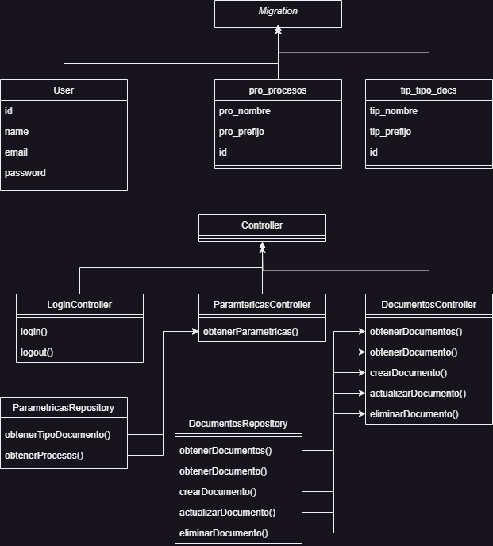

## Diagrama

## Intalación
1. Clonar el proyecto https://github.com/VaneTorres/pruebaInnClod_BackEnd.git
2. Correr el comando composer install
3. Cambiar las líneas 9 a 12 en el .env con la información de tu base de datos.
    DB_CONNECTION=mysql
    DB_HOST=127.0.0.1
    DB_PORT=3306
    DB_DATABASE=pruebainnclod
    DB_USERNAME=root
    DB_PASSWORD=
4. Correr el siguiente comando para cargar las migraciones y seeders
php artisan migrate --seed
5. Correr php artisan serve 
6. Ir al front del proyecto que se encuentra en el repositorio https://github.com/VaneTorres/innclod_FrontEnd y clonarlo
7. en el proyecto de front correr el comando npm install y npm run

### Credenciales de usuario
email:admin@gmail.com
Contraseña: 12345678

